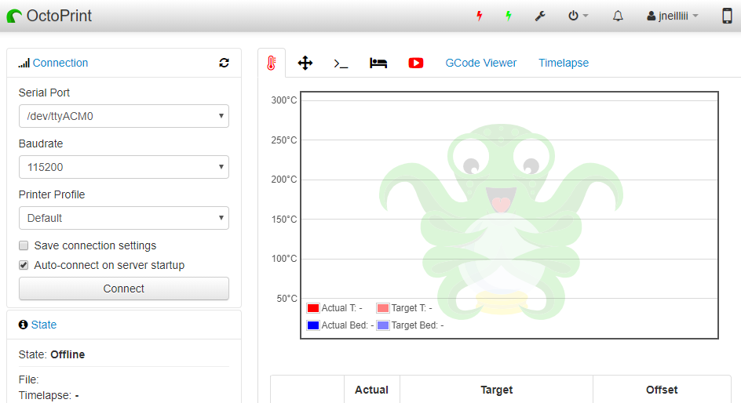
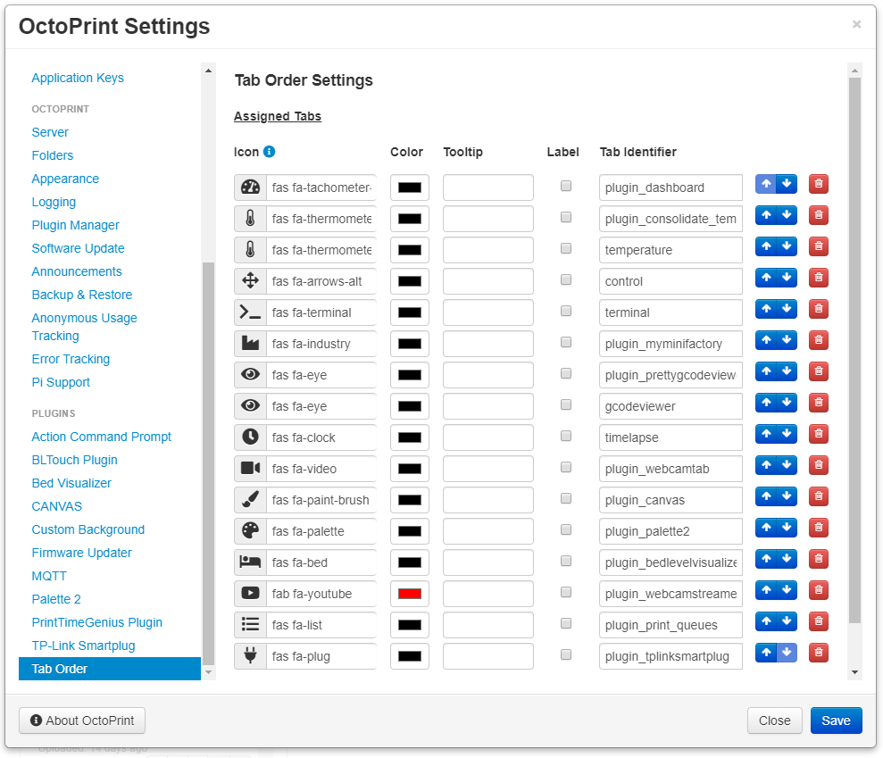

# OctoPrint-TabOrder

This plugin allows for controlling the order of tabs within the OctoPrint web interface. After changes are made you must do a force reload by holding down CTRL key while pressing the F5 key.

Now supports fontawesome icons!

## Setup

Install via the Plugin Manager or manually using this URL:

    https://github.com/jneilliii/OctoPrint-TabOrder/archive/master.zip

## Settings

## Changelog

### [0.5.1] - 2019-01-01
- Added resize event trigger onAllBound to remove tab stacking when only icons are used.

### [0.5.0] - 2018-05-12
- Simplified the process for adding tabs based on existing tabs detected within the interface.

### [0.4.1] - 2018-05-10
- Added icon color option and tooltip for hover text.

### [0.4.0] - 2018-05-09
- Added icon support. Credit to [ntoff](https://github.com/ntoff/OctoPrint-TabIcons) for the original idea. Uses the [fontawesom 4.7.0](https://fontawesome.com/v4.7.0/icons/) library for class names.

### [0.3.0] - 2018-01-24
- Updated pop up message for better clarification of the reload process.

### [0.2.0] - 2018-01-23
- Updated description that displays in Plugin Manager.

### [0.1.0] - 2018-01-19
- Initial release.

## Support My Efforts
I programmed this plugin for fun and do my best effort to support those that have issues with it, please return the favor and support me.

[0.5.1]: https://github.com/jneilliii/OctoPrint-TabOrder/tree/0.5.1
[0.5.0]: https://github.com/jneilliii/OctoPrint-TabOrder/tree/0.5.0
[0.4.1]: https://github.com/jneilliii/OctoPrint-TabOrder/tree/0.4.1
[0.4.0]: https://github.com/jneilliii/OctoPrint-TabOrder/tree/0.4.0
[0.3.0]: https://github.com/jneilliii/OctoPrint-TabOrder/tree/0.3.0
[0.2.0]: https://github.com/jneilliii/OctoPrint-TabOrder/tree/0.2.0
[0.1.0]: https://github.com/jneilliii/OctoPrint-TabOrder/tree/0.1.0

