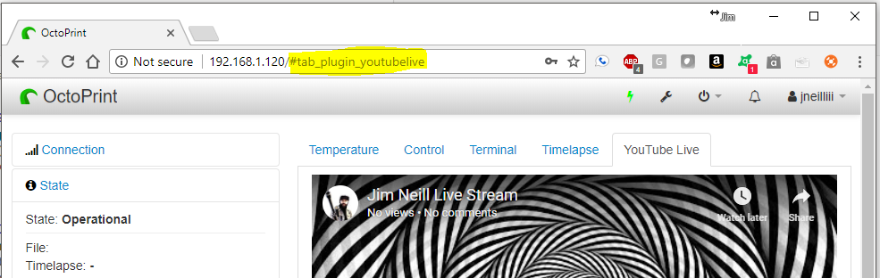
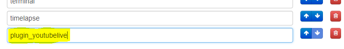

# OctoPrint-TabOrder

This plugin allows for controlling the order of tabs within the OctoPrint web interface. After changes are made you must do a force reload by holding down CTRL key while pressing the F5 key.

## Setup

Install via the Plugin Manager or manually using this URL:

    https://github.com/jneilliii/OctoPrint-TabOrder/archive/master.zip

## Settings

## Adding plugin tabs

The tab identifier for plugins can be obtained by clicking the tab in OctoPrint and emove the leading "tab_" from the hashtag found at the end of the url that loads. For example, the following url

becomes

in settings.

## Changelog

### [0.3.0] - 2018-01-24
- Updated pop up message for better clarification of the reload process.

### [0.2.0] - 2018-01-23
- Updated description that displays in Plugin Manager.

### [0.1.0] - 2018-01-19
- Initial release.

[0.3.0]: https://github.com/jneilliii/OctoPrint-TabOrder/tree/0.3.0
[0.2.0]: https://github.com/jneilliii/OctoPrint-TabOrder/tree/0.2.0
[0.1.0]: https://github.com/jneilliii/OctoPrint-TabOrder/tree/0.1.0